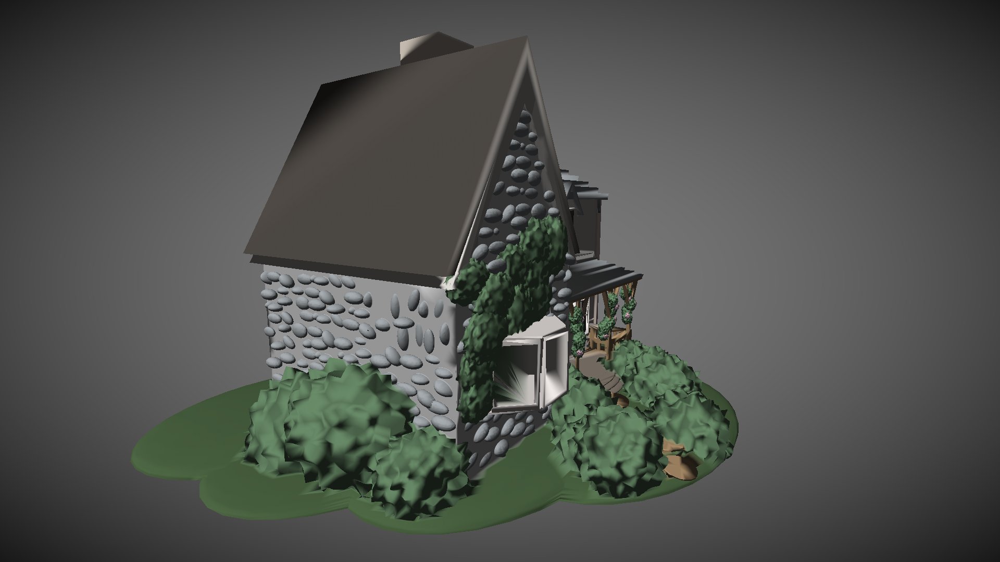

# 🖥️ CPU-Driven 3D Graphics Engine

Uma **engine gráfica 3D completa**, desenvolvida inteiramente em **C**, utilizando a **Raylib** apenas para controlar os pixels da tela (framebuffer).  
Todo o pipeline gráfico é processado **100% na CPU** e somente o resultado final é enviado para a GPU para exibição no monitor.  
Embora tenha sido criada para **fins de estudo**, os resultados de desempenho foram impressionantes.

---

## 🚀 Destaques de Performance

- **300 FPS** renderizando texturas com **milhares de triângulos**.
- **100 FPS** renderizando uma casa com **mais de 1 milhão de triângulos**.
- **Rasterização paralela altamente otimizada**, garantindo distribuição uniforme da carga entre os núcleos.
- Uso de **técnicas inspiradas em arquiteturas reais de GPUs** para alcançar máxima eficiência.

---

## ⚙️ Arquitetura da Engine

A engine segue um **pipeline gráfico próprio**, implementado em C, com as seguintes etapas principais:

### 1️⃣ Transformações e Pré-processamento
- Leitura de modelos 3D (formato `.obj` atualmente).
- Aplicação de **matrizes de transformação** (model, view, projection).
- Cálculo de **vetores normais** para iluminação.
- Preparação de **atributos por vértice** (cor, coordenadas UV, normais).
- **Subdivisão da tela em tiles de 64×64 pixels** para pré-classificação dos triângulos por região.
    - Esse pré-processamento evita desperdício de rasterização fora da área visível.
    - Facilita a paralelização, inspirando-se no conceito de **tile-based rendering** usado em GPUs.

### 2️⃣ Rasterização Paralela
- Sistema de **pilhas de tarefas**:  
  Cada núcleo retira triângulos de uma pilha compartilhada conforme sua disponibilidade, evitando:
  - **Race conditions**.
  - Distribuição desigual de carga.
- Essa abordagem garante **escala quase linear** com o número de núcleos.

### 3️⃣ Fragment Shader e Iluminação
- Implementação do algoritmo de **Phong shading** para difusão suave da luz nas superfícies.
- Interpolação de cores, normais e coordenadas UV por pixel.
- Suporte a **texturas** mapeadas.

---

## 🎯 Recursos Suportados

✅ Rasterização de triângulos 100% na CPU.  
✅ Atributos por vértice:
- Cor.
- Coordenadas UV (textura).
- Normais para iluminação.  
✅ Carregamento de modelos no formato **OBJ**.  
✅ Iluminação **Phong** (difusa e suave).  
✅ Paralelização otimizada para alto desempenho.  
✅ Tile-based rendering (64×64 pixels).  

---

## 📂 Formatos de Arquivo
- Atualmente, suporte apenas a `.obj`.  
- No futuro:  
  - Formatos que suportam atributos completos por vértice (ex: `.fbx`, `.gltf`).

---

## 🛠️ Tecnologias Usadas
- **C** (lógica e pipeline gráfico)
- **Raylib** (somente para manipulação do framebuffer e entrada de dados)
- **CPU Multi-threading** (para paralelizar rasterização e processamento)
- **Algoritmos inspirados em arquiteturas de GPU**

---

## 📸 Resultados Visuais

---

## 📜 Objetivos do Projeto
- **Estudo aprofundado** sobre o pipeline gráfico e funcionamento de GPUs.
- Explorar técnicas de **renderização baseada em CPU**.
- Analisar e implementar **estratégias de paralelização eficientes**.
- Criar uma base para futuras implementações (shaders customizados, suporte a mais formatos, física, etc).

---

## 📅 Próximos Passos
- Suporte a múltiplos formatos de modelo 3D.
- Implementação de **normal mapping** e **specular mapping**.
- Sistema de materiais mais robusto.
- Sombras dinâmicas.
- Otimizações adicionais no fragment shader.

---

## 📄 Licença

MIT License

Copyright (c) 2025 Eric Albuquerque

Permission is hereby granted, free of charge, to any person obtaining a copy
of this software and associated documentation files (the "Software"), to deal
in the Software without restriction, including without limitation the rights  
to use, copy, modify, merge, publish, distribute, sublicense, and/or sell  
copies of the Software, and to permit persons to whom the Software is  
furnished to do so, subject to the following conditions:

The above copyright notice and this permission notice shall be included in  
all copies or substantial portions of the Software.

THE SOFTWARE IS PROVIDED "AS IS", WITHOUT WARRANTY OF ANY KIND, EXPRESS OR  
IMPLIED, INCLUDING BUT NOT LIMITED TO THE WARRANTIES OF MERCHANTABILITY,  
FITNESS FOR A PARTICULAR PURPOSE AND NONINFRINGEMENT. IN NO EVENT SHALL THE  
AUTHORS OR COPYRIGHT HOLDERS BE LIABLE FOR ANY CLAIM, DAMAGES OR OTHER  
LIABILITY, WHETHER IN AN ACTION OF CONTRACT, TORT OR OTHERWISE, ARISING FROM,  
OUT OF OR IN CONNECTION WITH THE SOFTWARE OR THE USE OR OTHER DEALINGS IN  
THE SOFTWARE.
